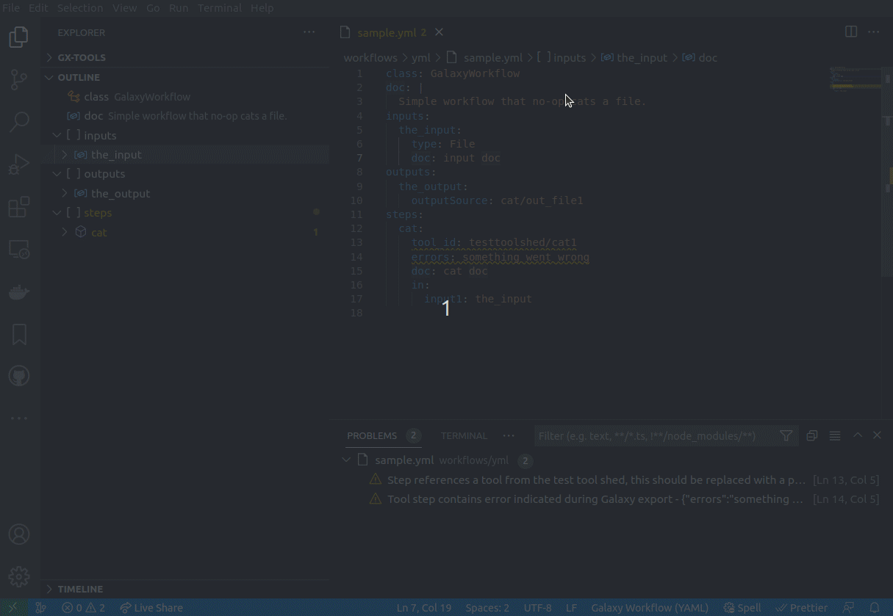
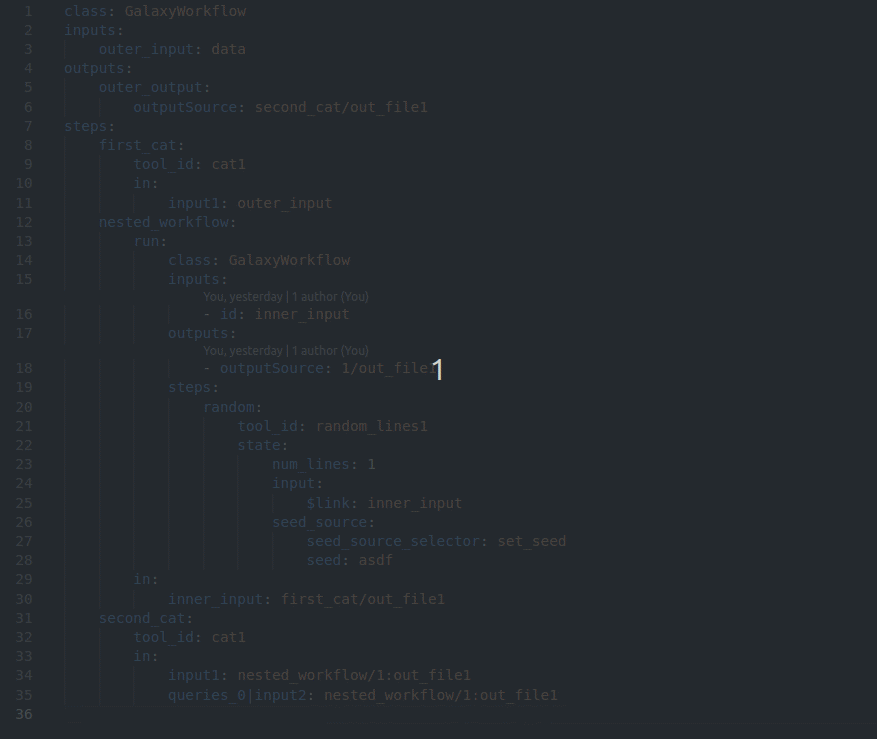
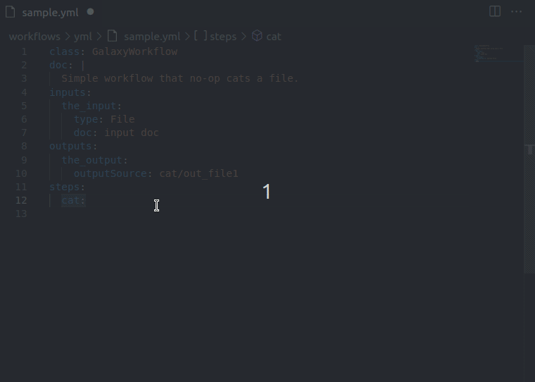
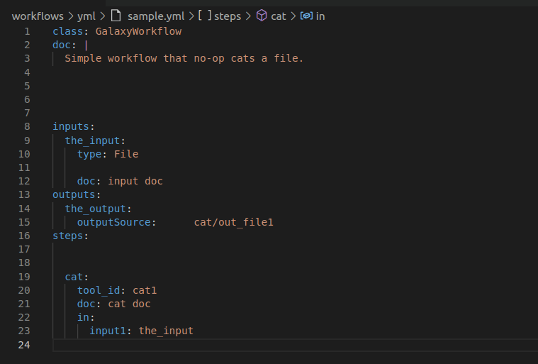
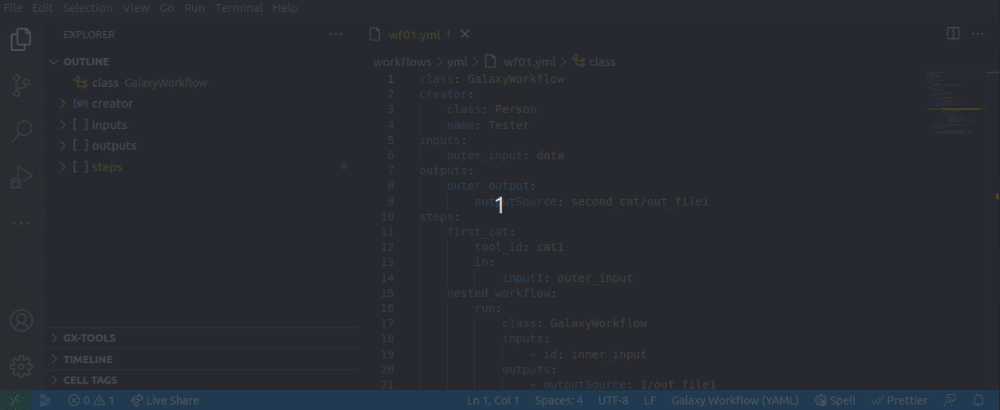
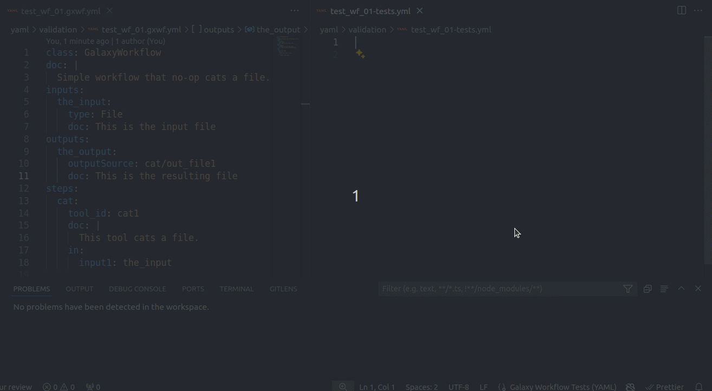

# Galaxy Workflows VSCode Extension

The **Galaxy Workflows VSCode extension** assists in editing [Galaxy](https://galaxyproject.org/) Workflow files while enforcing [best practices](https://planemo.readthedocs.io/en/latest/best_practices_workflows.html). Use it in combination with [Planemo](https://github.com/galaxyproject/planemo) for an optimal experience in developing and maintaining your Galaxy workflows.

You can install the extension locally or in a web context, such as [github.dev](https://github.dev) or [vscode.dev](https://vscode.dev). The extension aims to support as many features as possible in both modes, though the web mode may have some limitations.

The extension focuses on assisting with editing [**Format 2** Galaxy Workflow](https://github.com/galaxyproject/gxformat2) (**.gxwf.yml**) files. However, it also supports the _native_ **Galaxy Workflow** format documents (with **.ga** extension) for legacy reasons.

> ⚠️ Please note the _Native_ (or _Format1_) Galaxy Workflow format (.ga) is considered internal and is not meant to be edited manually. The support provided here is temporary and experimental. If you are developing workflows manually, use the new [**Format 2** Galaxy Workflow](https://github.com/galaxyproject/gxformat2) (.gxwf.yml).

If you find a bug or have a suggestion to improve your experience, please create a [new issue here](https://github.com/davelopez/galaxy-workflows-vscode/issues) or comment on any existing ones.

## Quick Start

> ⚠️ Important: To properly detect your Galaxy Workflow files, they must have the correct file extension. For **Format 2** Galaxy Workflows, use the `.gxwf.yml` extension, and for the _native_ Galaxy Workflows, use the `.ga` extension.

### Option 1: Install extension locally

1. Open VSCode
2. Install the extension from the [Marketplace](https://marketplace.visualstudio.com/items?itemName=davelopez.galaxy-workflows).
3. Open any Galaxy Workflow document (.gxwf.yml or .ga) and the extension will activate.

### Option 2: Use it directly in `vscode.dev` or `github.dev`

1. For example, open the IWC (_Intergalactic Workflow Commission_) repository on GitHub

   

2. Install the extension if you haven't already:

   - Go to the extensions panel (`Ctrl+Shift+x`), search for `davelopez.galaxy-workflows`, and click `Install`

3. Enjoy the workflow editing features directly on your browser ✨

## Changelog

See the [full changelog here](CHANGELOG.md#change-log).

## Contributing

✨ Contributors are welcome! ✨

Just make sure to read the [Contributing Guidelines](docs/CONTRIBUTING.md) 😉

## Features

The following table shows all the implemented features and the current support for each workflow format.

| Feature                                                             | Legacy Workflows (.ga) | Format 2 Workflows (.gxwf.yml) |
| ------------------------------------------------------------------- | :--------------------: | :----------------------------: |
| [Validation](#workflow-validation)                                  |           ✔️           |               ✔️               |
| [Documentation on Hover](#documentation-on-hover)                   |           ✔️           |               ✔️               |
| [IntelliSense](#intellisense)                                       |           ✔️           |               ✔️               |
| [Formatting](#formatting)                                           |           ✔️           |               ✔️               |
| [Custom Outline](#custom-outline)                                   |           ✔️           |               ✔️               |
| [Workflow Cleanup Command](#workflow-cleanup-command)               |           ✔️           |               ❔               |
| [Simplified Workflow Diffs](#simplified-workflow-diffs)             |           🔶           |               ❔               |
| [Workflow Tests Document Support](#workflow-tests-document-support) |           ✔️           |               ✔️               |

Legend

✔️ Feature supported in latest version.

🔜 Feature not yet available but planned for future release.

❔ This feature may not apply to this format or is not planned yet.

🔶 This feature is only supported in local repositories or file systems. Not supported in _Web_ mode or _Virtual File Systems_.

❌ This feature is not supported for this format.

### Workflow Validation

You will receive diagnostics for every syntax error or incorrect property value as you type, allowing you to fix them immediately.

#### Gxformat2 (yaml)

#### Legacy (ga)

[Back to Features ⬆️](#features)

### Documentation on Hover

Hover over properties to get a description of what they are and how to use them. The documentation displayed is based on the Workflow schema annotations. If need more details or find something incorrect, please help us improve the schema [here](https://github.com/galaxyproject/gxformat2)!

#### Gxformat2 (yaml)

#### Legacy (ga)

[Back to Features ⬆️](#features)

### IntelliSense

Get [IntelliSense](https://code.visualstudio.com/docs/editor/intellisense#:~:text=IntelliSense%20is%20a%20general%20term,%2C%20and%20%22code%20hinting.%22) suggestions based on your cursor context. You can manually trigger suggestions at your current cursor position using `Ctrl+Space`.

#### Gxformat2 (yaml)

#### Legacy (ga)

[Back to Features ⬆️](#features)

### Formatting

Keep your workflow document consistently formatted. We recommend enabling the VSCode `Format on Save` setting so you don't have to manually format after making changes.

#### Gxformat2 (yaml)

#### Legacy (ga)

[Back to Features ⬆️](#features)

### Custom Outline

The `Custom Outline` allows you to navigate and find different parts of the Workflow faster using the Outline panel or [Breadcrumbs](https://code.visualstudio.com/docs/editor/editingevolved#_breadcrumbs). Compared to the standard JSON Outline, the enhanced Outline representation displays relevant information more prominently (e.g., using the workflow step name instead of the index on step nodes) and hides non-essential nodes.

#### Gxformat2 (yaml)

#### Legacy (ga)

[Back to Features ⬆️](#features)

### Workflow Cleanup Command

You can clean up the non-essential properties of a (legacy .ga) workflow with this command. These properties are usually related to the display of the workflow in the editor and are not part of the workflow semantics. This command will remove those properties from the document, but you can also use the `Preview clean workflow` command to show a preview of the clean workflow without making changes to the original.

#### Legacy (ga)

[Back to Features ⬆️](#features)

### Simplified Workflow Diffs

> ⚠️ This feature is experimental and is only available using a local git repository.

Sometimes you want to compare different revisions of the same (legacy .ga) workflow and see what has changed. If the workflow has been through the Galaxy editor or some nodes have been moved around, there can be many cosmetic changes that are not part of the workflow logic. In those cases, you may want to get a 'simplified' diff to focus on the 'real' changes. You can do this in <del>the `Timeline` or</del> the `File Explorer` by using `Select workflow for (clean) compare` in one revision and then `Compare with this workflow (clean)` in the other revision. This will compare both revisions using the 'clean' version of the workflow (see the [Workflow Cleanup Command](#workflow-cleanup-command)), meaning the non-essential parts are removed from both documents before the comparison.

> ⚠️ **NOTE**:
> This feature is no longer supported in the `Timeline` until a new version of the VSCode Timeline API is finalized and published. See [this PR](https://github.com/davelopez/galaxy-workflows-vscode/pull/59) for more details.

#### Legacy (ga)

### Workflow Tests Document Support

You can now edit Workflow Test Files (`*-test.yml`) with basic language support. This includes syntax highlighting, validation, auto-completion, and documentation on hover based on the _experimental_ schema for Workflow Test Files.

[Back to Features ⬆️](#features)
