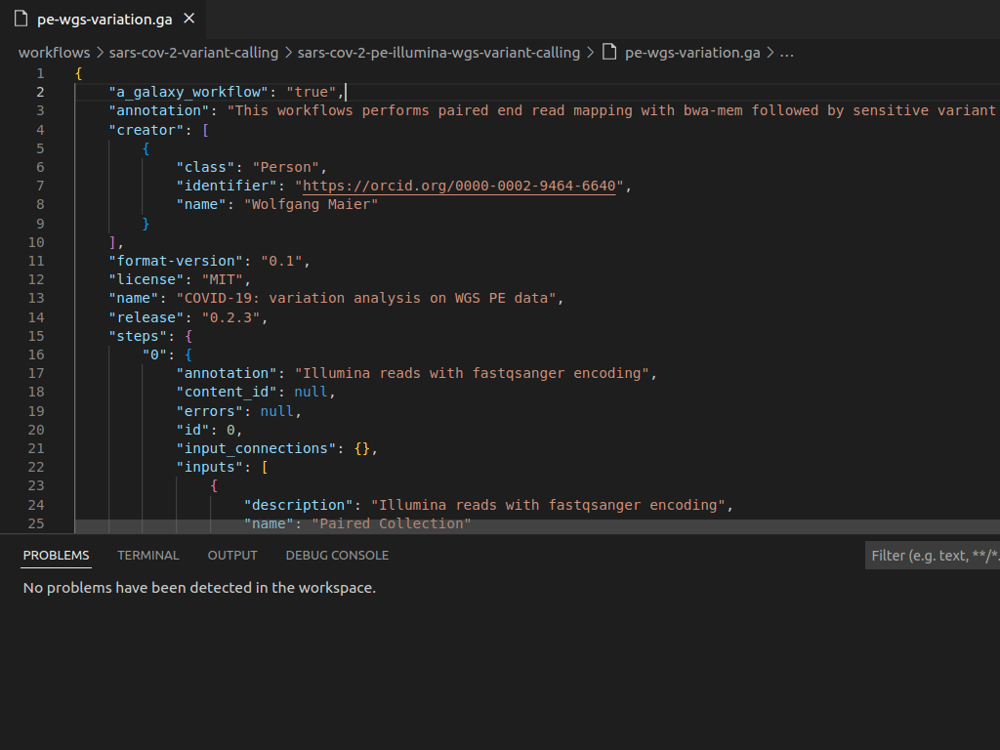
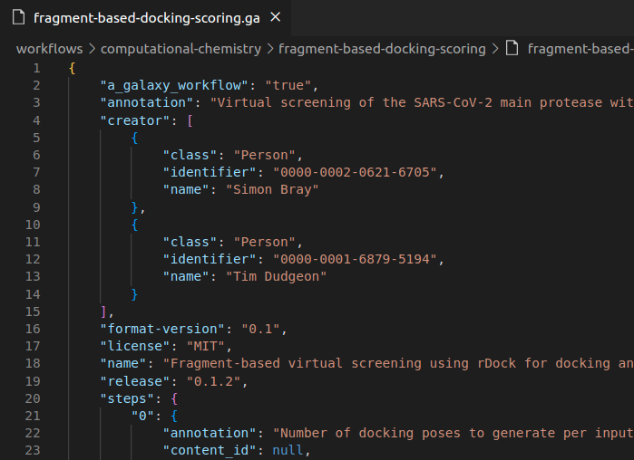
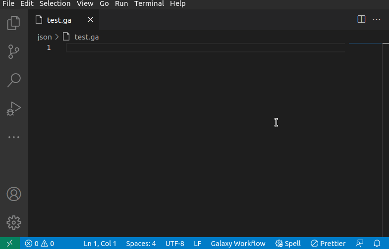
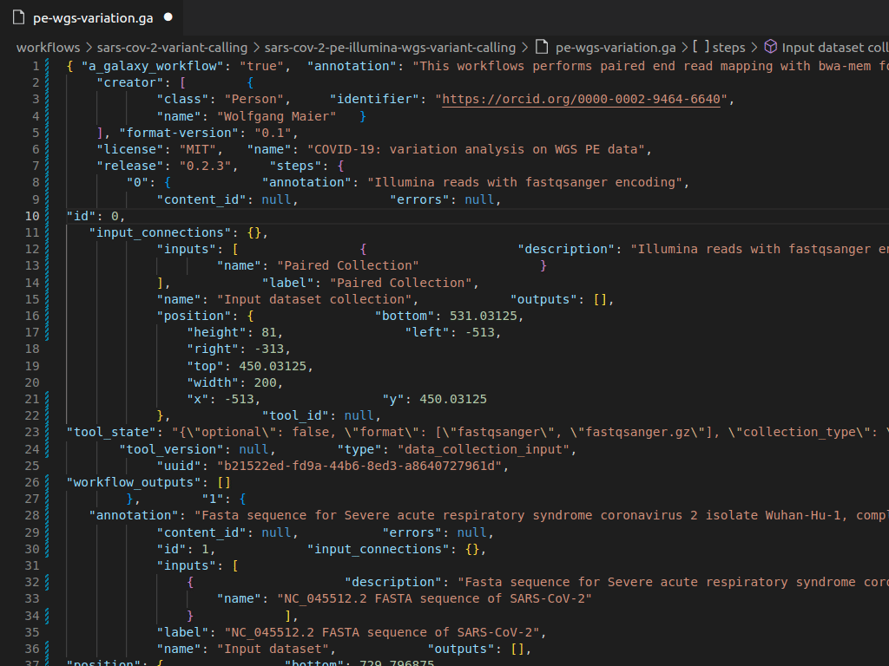
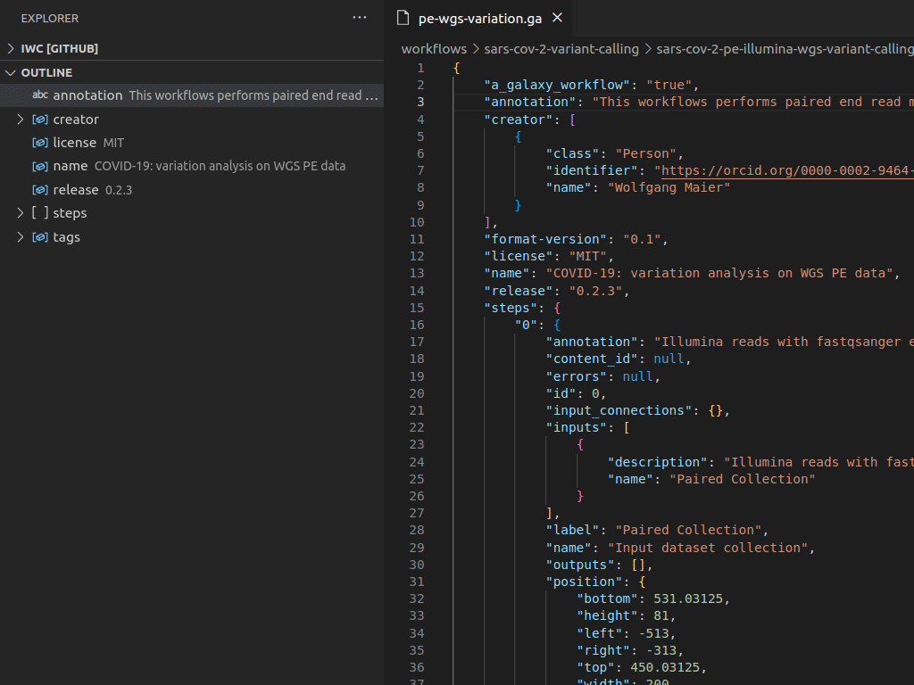
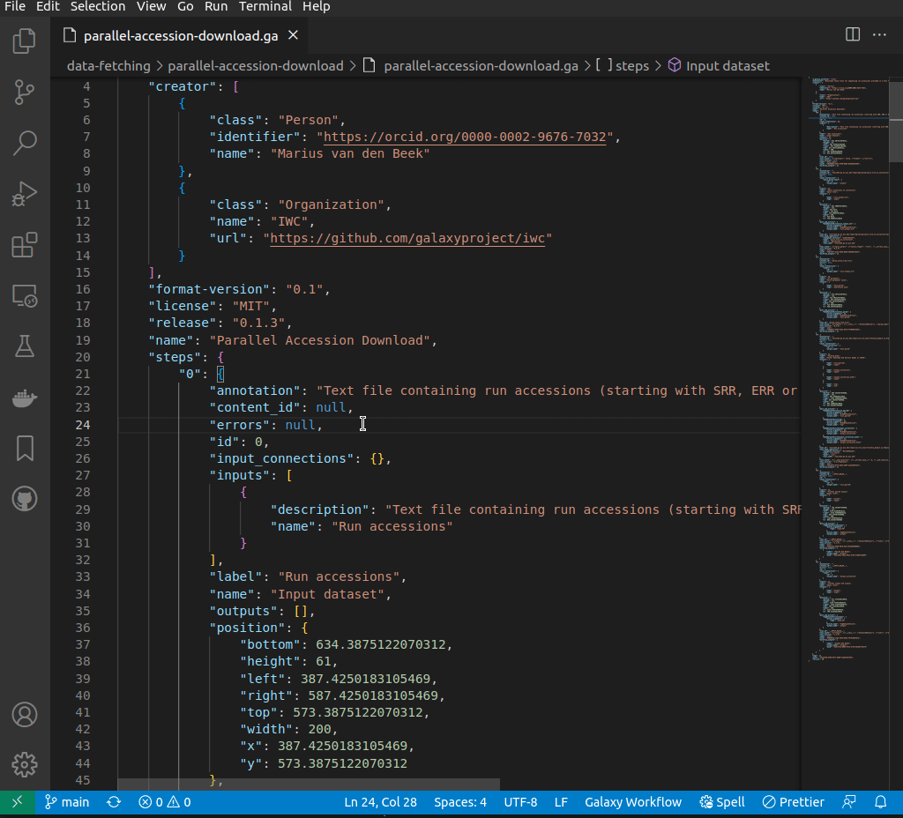

# Galaxy Workflows VSCode Extension

[](https://opensource.org/licenses/MIT)


VSCode extension to assist in editing [Galaxy Workflow](https://galaxyproject.org/) files while enforcing [best practices](https://planemo.readthedocs.io/en/latest/best_practices_workflows.html) for maintaining them.

The initial version of the extension is focused on supporting the current **Galaxy Workflow _native_** format (documents with **.ga** extension) but the idea is to include support for the next format called **Format 2** (also known as [gxformat2](https://github.com/galaxyproject/gxformat2)) in the near future.

## Features

The extension is being developed with VSCode **Web** support in mind, meaning that most of the features should work directly in a web context, like [github.dev](https://github.dev) or [vscode.dev](https://vscode.dev).

The following table shows all the implemented features and the current support for each workflow format.

| Feature                                                    | Native Workflows (.ga) | Format 2 Workflows (gxformat2) |
| ---------------------------------------------------------- | :--------------------: | :----------------------------: |
| [Document Validation](#document-validation)                |   :heavy_check_mark:   |              :x:               |
| [Documentation on Hover](#documentation-on-hover)          |   :heavy_check_mark:   |              :x:               |
| [IntelliSense](#intellisense)                              |   :heavy_check_mark:   |              :x:               |
| [Formatting](#formatting)                                  |   :heavy_check_mark:   |              :x:               |
| [Custom Outline](#custom-outline)                          |   :heavy_check_mark:   |              :x:               |
| [Workflow Cleanup Command](#workflow-cleanup-command)      |   :heavy_check_mark:   |              :x:               |
| [Simplified Workflow Diffs](#simplified-workflow-diffs) \* |   :heavy_check_mark:   |              :x:               |

(\*) This feature is not supported in _Web_ mode or _Virtual File Systems_.

### Document Validation

You will get diagnostics for every syntax error or incorrect property value as you type so you can fix them right away.



Back to [Features](#features)

### Documentation on Hover



Back to [Features](#features)

### IntelliSense



Back to [Features](#features)

### Formatting



Back to [Features](#features)

### Custom Outline



Back to [Features](#features)

### Workflow Cleanup Command



Back to [Features](#features)

### Simplified Workflow Diffs


Back to [Features](#features)

## Development

- Clone this repo (or your own fork) and open it in VSCode:
  ```sh
  git clone https://github.com/davelopez/galaxy-workflows-vscode.git
  cd galaxy-workflows-vscode
  code .
  ```
- Install dependencies:
  ```sh
  npm install
  ```
- Build
  ```sh
  npm run compile
  ```
- Run the `Launch Extension` configuration from the `Run and Debug` action bar (or press F5).
